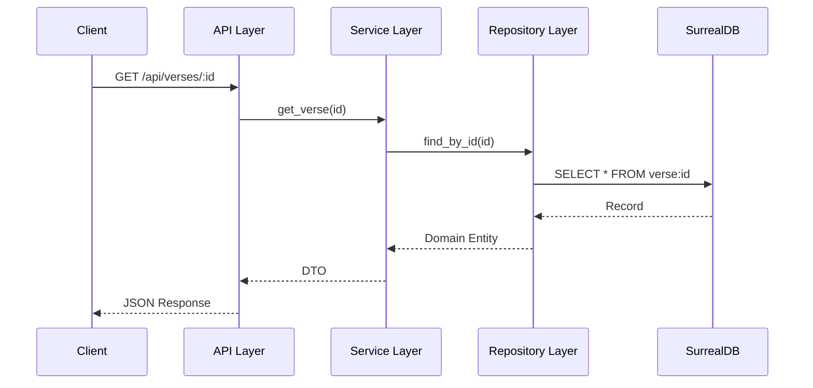

# System Architecture

The Al-Mizan Project is built upon the principles of **Clean Architecture** (also known as Onion or Hexagonal Architecture). This ensures that the core business logic (Domain) is independent of external frameworks, databases, and user interfaces.

## High-Level Overview

```mermaid
graph TD
    User[User] -->|HTTPS| PublicApp[Certainty Engine (Public App)]
    Scholar[Scholar] -->|HTTPS| AdminApp[Verification Console (Admin)]
    
    PublicApp -->|REST API| Backend[Backend (Rust/Axum)]
    AdminApp -->|REST API| Backend
    
    Backend -->|SurrealQL| DB[(SurrealDB)]
    
    subgraph "Backend Layer"
        API[API Layer]
        Service[Service Layer]
        Domain[Domain Layer]
        Repo[Repository Layer]
        
        API --> Service
        Service --> Domain
        Service --> Repo
        Repo --> DB
    end
```

## Core Components

### 1. Frontend (Presentation Layer)

 The frontend adopts a **No-Build** philosophy for simplicity and performance:

* **Tech Stack**:
  * **HTML/CSS**: Server-rendered templates using **Askama**.
  * **Interactivity**: **HTMX** for dynamic partial updates.
  * **Visualization**: **Cytoscape.js** for the Knowledge Graph.
  * **Styling**: Vanilla CSS with Glassmorphism design system.

* **Key Features**:
  * **Knowledge Graph**: Interactive visualization of Islamic concepts.
  * **AI Expansion**: Double-tap nodes to generate new connections via Gemini AI.

### 2. AI Integration (Intelligence Layer)

* **Provider**: Google Gemini Pro (via `reqwest`).
* **Status**: **TRANSITIONAL / TEMPORARY**.
* **Role**: Generates semantic connections between nodes (Verses, Scholars, Hadiths) to expand the graph dynamically.
* **Safety**: Enforces Tawhidic context in prompts.
* **Strategic Roadmap**:
  * **Phase 1 (Current)**: Use external API for rapid prototyping and validation.
  * **Phase 2**: Fine-tune open-source models (e.g., Llama 3, Mixtral) on Islamic datasets.
  * **Phase 3**: Self-host aligned models on independent infrastructure to eliminate external reliance.

### 2. Backend (Application & Domain Layer)

* **Tech**: Rust, Axum.

* **Role**: Orchestrates business logic, validates rules, and manages data flow.
* **Structure**:
  * `api/`: HTTP handlers and routing.
  * `domain/`: Core business entities and logic (pure Rust, no dependencies).
  * `service/`: Application use cases.
  * `repository/`: Data access interfaces.

### 3. Database (Infrastructure Layer)

* **Tech**: SurrealDB.

* **Role**: Persists data and handles complex graph queries.
* **Why SurrealDB?**: It natively supports graph relationships, which is essential for mapping the intricate connections between Quranic verses and Hadith.

## Data Flow

### Request Lifecycle



## Security Architecture

* **Authentication**: JWT-based stateless authentication.
* **Password Hashing**: Argon2id for secure password storage.
* **Input Validation**: Strong typing in Rust ensures invalid data is caught at the boundary.
