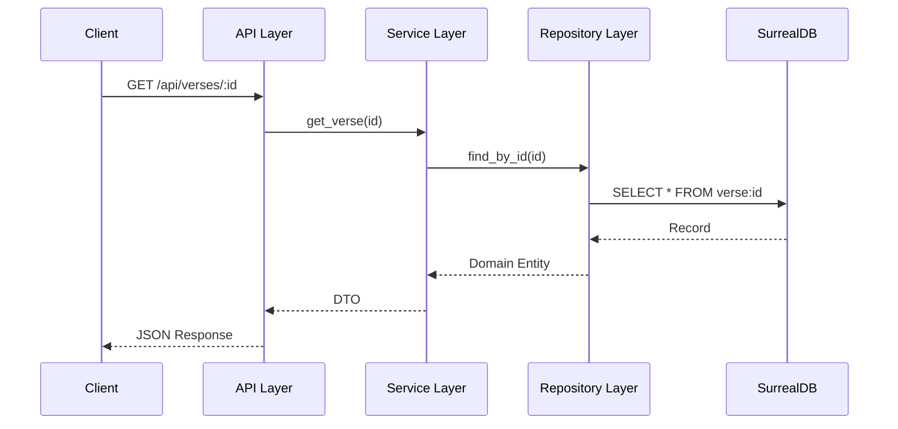

# System Architecture

The Al-Mizan Project is built upon the principles of **Clean Architecture** (also known as Onion or Hexagonal Architecture). This ensures that the core business logic (Domain) is independent of external frameworks, databases, and user interfaces.

## High-Level Overview

```mermaid
graph TD
    User[User] -->|HTTPS| PublicApp[Certainty Engine (Public App)]
    Scholar[Scholar] -->|HTTPS| AdminApp[Verification Console (Admin)]
    
    PublicApp -->|REST API| Backend[Backend (Rust/Axum)]
    AdminApp -->|REST API| Backend
    
    Backend -->|SurrealQL| DB[(SurrealDB)]
    
    subgraph "Backend Layer"
        API[API Layer]
        Service[Service Layer]
        Domain[Domain Layer]
        Repo[Repository Layer]
        
        API --> Service
        Service --> Domain
        Service --> Repo
        Repo --> DB
    end
```

## Core Components

### 1. Frontend (Presentation Layer)

 The frontend adopts a **No-Build** philosophy for simplicity and performance:

* **Tech Stack**:
  * **HTML/CSS**: Server-rendered templates using **Askama**.
  * **Interactivity**: **HTMX** for dynamic partial updates.
  * **Visualization**: **Cytoscape.js** for the Knowledge Graph.
  * **Styling**: Vanilla CSS with Glassmorphism design system.

* **Key Features**:
  * **Knowledge Graph**: Interactive visualization of Islamic concepts.
  * **AI Expansion**: Double-tap nodes to generate new connections via Gemini AI.

### 2. AI Integration (Intelligence Layer)

* **Role**: **Search & Syntax Helper ONLY**.
* **Restriction**: **NO GENERATIVE AI** for defining truth-relationships.

### 3. The "Cyborg" Ingestion Pipeline (AI-Human Hybrid)

To solve the "Ingestion Bottleneck" (6,000+ verses, 500k+ Hadith), we employ a strict **Human-in-the-Loop** pipeline:

1. **OCR Scraper (AI)**:
    * **Input**: PDF/Scanned Classical Texts (e.g., *Al-Majmu'*).
    * **Action**: AI extracts entities and relationships (Scholar -> Opinion -> Topic).
    * **Output**: `UNVERIFIED_DRAFT` nodes.

2. **Micro-Waqf (Gamification)**:
    * **Input**: `UNVERIFIED_DRAFT` nodes.
    * **Action**: Students/Researchers verify AI output against the source image via the "Verification Console".
    * **Incentive**: Earn "Hasana Tokens" (Reputation) for correct verifications.
    * **Output**: `PEER_REVIEWED` nodes.

3. **Mizan Stamp (Cryptographic Commit)**:
    * **Input**: `PEER_REVIEWED` nodes.
    * **Action**: Senior Scholars sign the node with their DID Private Key.
    * **Output**: `IMMUTABLE_TRUTH` (Canon).

### 1. The Citadel Node (Backend)

* **Runtime**: Rust (Axum).

* **Database**: SurrealDB (Embedded/Local).
* **Role**: Manages the local graph, handles queries, and generates/ingests snapshots.

### 2. The Interface (Frontend)

* **Tech**: HTML/HTMX (Server-Side Rendered).

* **Philosophy**: "No-Build" - simple, lightweight, and modifiable.

### 3. The Protocol (Sync)

* **Format**: Signed JSON Snapshots.

* **Transport**: USB, LAN, IPFS.
* **Logic**: Additive Union with "Mizan" Weighting.

## Data Flow

### Request Lifecycle



## Security Architecture

* **Authentication**: JWT-based stateless authentication.
* **Password Hashing**: Argon2id for secure password storage.
* **Input Validation**: Strong typing in Rust ensures invalid data is caught at the boundary.
