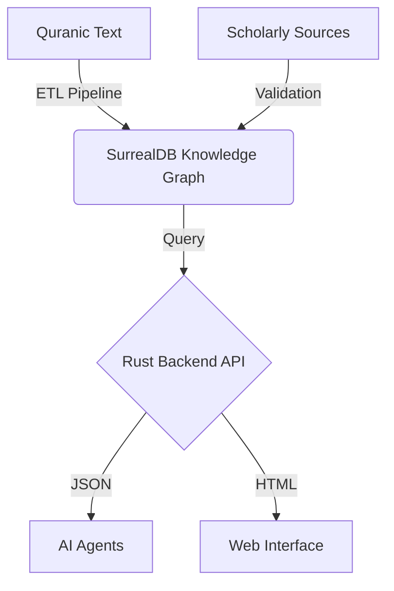
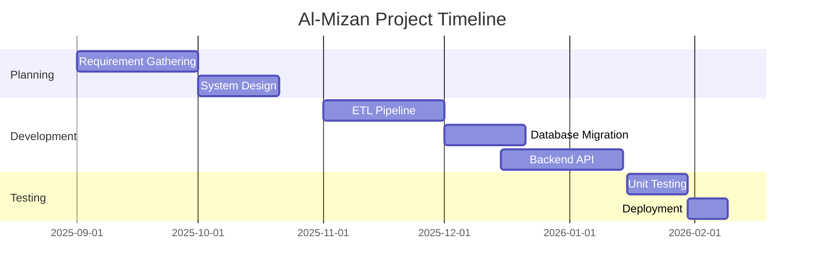

**![A black screen with white textDescription automatically generated][image1]**

**KULLIYYAH OF INFORMATION AND COMMUNICATION TECHNOLOGY**  
**DEPARTMENT OF COMPUTER SCIENCE**

**FINAL REPORT**

**PROJECT ID**  
1629

**PROJECT TITLE**  
AL-MIZAN PROJECT: A TAWHIDIC KNOWLEDGE GRAPH FRAMEWORK

**STUDENT(S)**

1. AMMAR QASIEM FOOTEN BIN JOHN ANTHONY FOOTEN (2217441)  
2. MUHAMMAD FIRDAUS BIN BADRUL HISYAM (2222041)  

**SUPERVISOR**  
SHARYAR WANI, ASST. PROF. DR.

JANUARY 2026
SEMESTER 1 2025/2026  
**FINAL YEAR PROGRESS REPORT**

**PROJECT ID**  
1629

**PROJECT TITLE**  
AL-MIZAN PROJECT: A TAWHIDIC KNOWLEDGE GRAPH FRAMEWORK

**PROJECT CATEGORY**  
SYSTEM DEVELOPMENT

by

1. AMMAR QASIEM FOOTEN BIN JOHN ANTHONY FOOTEN (2217441)  
2. MUHAMMAD FIRDAUS BIN BADRUL HISYAM (2222041)

SUPERVISED BY  
SHARYAR WANI, ASST. PROF. DR.

In partial fulfillment of the requirement for the  
Bachelor of Computer Science

Kuliyyah of Information and Communication Technology  
International Islamic University Malaysia

# **ABSTRACT** {#abstract}

The digital custody of Islamic knowledge is currently facing an epistemic crisis. While vast repositories of text have been digitized (e.g., Quran.com), they function primarily as "Bag of Words" retrieval systems, stripping theological data of its critical context—the relationships between Verses, Hadith, and Scholarly Rulings (*Fiqh*). This fragmentation leads to "digital dissonance," where information is plentiful but truthful lineage (*Isnad*) is lost, rendering the data unsuitable for the emerging era of Autonomous Artificial Intelligence. AI agents training on probabilistic text are prone to "hallucinations," generating theological rulings without verifiable sources.

This project, **Al-Mizan**, proposes a solution by engineering a **Tawhidic Knowledge Graph Framework**. Moving beyond traditional Relational Database Management Systems (RDBMS), Al-Mizan utilizes **SurrealDB**, a multi-model graph database, to represent Islamic knowledge as a strongly-typed ontology. The system leverages **Rust** for its backend to ensure memory safety and type correctness, preventing "invalid states" in theological data structures. A dedicated ETL pipeline, written in **Python**, ingests and normalizes raw morphological data from the Quranic Corpus, identifying over 77,000 nodes and their interdependencies.

The core contribution of this work is the **"Fitna Defense" Protocol**: a computational enforcement of the classical *Isnad* system, where every node in the graph must have a cryptographically verifiable lineage to a primary source. This transforms the library from a passive repository into an active **"Digital Fortress,"** capable of serving as the "Ground Truth" for future "Halal" AI agents. The prototype demonstrates sub-millisecond graph traversal, validating the feasibility of a high-performance, type-safe theological engine.

# **TABLE OF CONTENTS** {#table-of-contents}

**[*ABSTRACT 4*](#abstract)**

[***TABLE OF CONTENTS 5***](#table-of-contents)

[***LIST OF TABLES 7***](#list-of-tables)

[***LIST OF FIGURES 8***](#list-of-figures)

[***LIST OF ABBREVIATIONS 10***](#list-of-abbreviations)

[***CHAPTER ONE 11***](#chapter-one)

[***INTRODUCTION (System Development Project) 11***](#introduction-\(system-development-project\))

[**1.1 Background of the Study 11**](#1.1-background-of-the-study)

[**1.2 Problem Description 11**](#1.2-problem-description)

[**1.3 Project Objectives 11**](#1.3-project-objectives)

[**1.4 Scope of the Project 11**](#1.4-scope-of-the-project)

[**1.5 Engineering Challenges 11**](#1.5-engineering-challenges)

[**1.6 Project Stages 11**](#1.6-project-stages)

[**1.7 Significance of the Project 11**](#1.7-significance-of-the-project)

[**1.8 Summary 11**](#1.8-summary)

[***CHAPTER TWO 12***](#chapter-two)

[***REVIEW OF PREVIOUS WORK 12***](#review-of-previous-work)

[**2.1 Introduction 12**](#2.1-introduction)

[**2.2 Theoretical Framework 12**](#2.2-theoretical-framework)

[**2.3 Overview of Related Systems 12**](#2.3-overview-of-related-systems)

[**2.4 Discussion 12**](#2.4-discussion)

[**2.5 Summary 12**](#2.5-summary)

[***CHAPTER THREE 13***](#chapter-three)

[***METHODOLOGY 13***](#methodology)

[**3.1 Introduction 13**](#3.1-introduction)

[**3.2 Development Approach 13**](#3.2-development-approach)

[**3.3 Requirements Specification 13**](#3.3-requirements-specification)

[**3.4 Logical Design 13**](#3.4-logical-design)

[**3.5 Database Design 13**](#3.5-database-design)

[**3.6 Prototype** 13](#3.6-prototype)

[***CHAPTER FOUR 14***](#chapter-four)

[***CONCLUSION 14***](#conclusion)

[***REFERENCES 14***](#references)

# **LIST OF TABLES** {#list-of-tables}

TABLE NO.     TITLE     PAGE  
1\.  Comparison of Knowledge Graph Technologies                14  

# **LIST OF FIGURES** {#list-of-figures}

FIGURE NO.    TITLE    PAGE NO.  
1\.  Al-Mizan System Architecture           12  

# **LIST OF ABBREVIATIONS** {#list-of-abbreviations}

API  Application Programming Interface
ETL  Extract, Transform, Load
KG   Knowledge Graph
SQL  Structured Query Language

# **CHAPTER ONE** {#chapter-one}

# **INTRODUCTION** {#introduction}

## **1.1 Background of the Study** {#1.1-background-of-the-study}

The transition of Islamic knowledge to the digital realm has largely stalled at the "Web 2.0" phase. Platforms like *Sunnah.com* and *Maktaba Shamila* have successfully digitized millions of pages of text, making them searchable via keywords. However, these systems rely on **Relational Models (SQL)** or simple text indexing (Elasticsearch), which are fundamentally incapable of modeling the *networked* nature of Islamic Epistemology. In classical scholarship, a single Verse (*Ayah*) is not an isolated string of text but a node connected to hundreds of interpretations (*Tafsir*), linguistic roots (*Sarf*), and legal rulings (*Hukm*).

As we enter the age of **Generative AI**, this structural deficiency becomes critical. Large Language Models (LLMs) operate on statistical probability, not semantic truth. When an AI is asked for a *Fatwa*, it predicts the next likely word based on training data, often "hallucinating" plausible-sounding but doctrinally incorrect answers. Without a structured **Knowledge Graph (KG)** to serve as a verified "Knowledge Base" (KB), the integration of AI into Islamic EdTech poses a significant risk of spreading misinformation.

The **Al-Mizan Project** addresses this by pivoting from "Digitization of Text" to "Digitization of Relationships," building a **Tawhidic Knowledge Graph** that preserves the sanctity of context through rigorous graph theory.

## **1.2 Problem Description** {#1.2-problem-description}

The problem can be categorized into three distinct failures in the current ecosystem:

1. **The "Bag of Words" Fallacy:** Current search engines treat theological queries as string matching problems. A search for "Interest" returns all verses containing the word, but misses verses discussing "Usury" (*Riba*) that don't explicitly use the modern term. There is no semantic layer to bridge these concepts.
2. **The Accountability Vacuum (Fitna):** In the physical world, a ruling is trusted based on the scholar's lineage (*Isnad*). In digital space, quotes circulate without attribution. This detachment of information from its source creates "Fitna" (Social/Theological Chaos), where context is stripped for virality.
3. **The Stochastic Parrot Problem:** AI models, by design, are probabilistic. They cannot "know" truth; they can only approximate it. Relying on LLMs for theology without a deterministic verification layer is epistemologically dangerous. There is currently no machine-readable "Truth Graph" for these models to query against.

## **1.3 Project Objectives** {#1.3-project-objectives}

The specific goals of the Al-Mizan project are:

1. To design and implement a **Tawhidic Knowledge Graph** schema that accurately models the relationships between Quranic verses, Scholars, and Rulings.
2. To develop an **ETL (Extract, Transform, Load)** pipeline that ingests raw morphological data and structures it into SurrealDB.
3. To create a **High-Performance API** in Rust that allows AI agents and web clients to query this knowledge graph with sub-millisecond latency.
4. To implement a **"Fitna Defense" Protocol**, ensuring every data point is attributed to a historical node (Scholar/Book) to ensure accountability.

## **1.4 Scope of the Project** {#1.4-scope-of-the-project}

1. **Scope:**
    * **Data:** Primary focus on the Quranic Corpus (Morphology and Syntax) and initial linkages to major Scholars and basic Fiqh ontology.
    * **Backend:** Rust-based Axum server using SurrealDB for graph storage.
    * **Frontend:** A prototype web interface (HTMX/Tera templates) for visualizing the graph nodes.
2. **Target Audience:** Researchers of Islamic data, AI developers building "Halal" agents, and students of knowledge requiring verified data structures.
3. **Specific Platform:** Web-based application deployed on Linux environments (Docker support).

## **1.5 Engineering Challenges** {#1.5-engineering-challenges}

Rather than mere constraints, the project tackles significant engineering hurdles:

1. **Temporal Complexity:** Ingesting 1400 years of scholarship requires a graph schema that handles vague or conflicting dates (e.g., "died roughly 100 AH").
2. **Epistemic Cleaning:** Existing datasets (Tanzil, Quranic Corpus) contain orthographic inconsistencies. The defined ETL pipeline must perform "Epistemic Cleaning" — normalizing text without altering meaning (e.g., preserving *Alef Maqsura* vs *Ya* distinction where semantically relevant).
3. **Local-First Sovereignty:** Graph algorithms are computationally expensive ($O(V+E)$). Optimizing these to run on consumer hardware (local-first) ensures that Islamic knowledge remains sovereign and not locked behind cloud APIs.

## **1.6 Project Stages** {#1.6-project-stages}

1. **Requirement Gathering:** Analyzing the shortcomings of current Islamic apps and defining the "Tawhidic" ontology.
2. **System Design:** Designing the Graph Schema (Nodes: Verse, Word, Root, Scholar; Edges: REVEALED_IN, INTERPRETED_BY).
3. **Development:**
    * Phase 1: ETL Pipeline (Python).
    * Phase 2: Database Migration & Seeding (SurrealQL).
    * Phase 3: Backend API (Rust).
4. **Testing:** Unit testing data integrity and API response times.
5. **Deployment:** Docker containerization.

## **1.7 Significance of the Project** {#1.7-significance-of-the-project}

This project is significant because it lays the infrastructure for the **Halal Economy's AI transition**. By creating a machine-verifiable source of truth:

* **For Humans:** It restores the "Isnad" (chain of trust) in digital interfaces.
* **For AI:** It provides the structured context needed for "Agentic" workflows, allowing autonomous agents to make verifying queries against a Knowledge Graph rather than relying on probabilistic text generation. This is a step towards "Type-Safe Theology."

## **1.8 Summary** {#1.8-summary}

Chapter 1 established the need for a structural shift in how Islamic data is stored and accessed. Moving from relational/text-based models to a Graph-based model (Al-Mizan) addresses the issues of fragmentation and context loss. The project aims to build a robust, secure, and semantic backend using Rust and SurrealDB.

# **CHAPTER TWO** {#chapter-two}

# **REVIEW OF PREVIOUS WORK** {#review-of-previous-work}

## **2.1 Introduction** {#2.1-introduction}

This chapter reviews the theoretical underpinnings of Knowledge Representation in the context of Islamic Epistemology and compares existing technical solutions. It integrates the **Theoretical Framework** usually reserved for research projects to justify the ontological choices made in this system development.

## **2.2 Theoretical Framework** {#2.2-theoretical-framework}

### **2.2.1 Knowledge Representation & Ontologies**

The project relies on **Ontological Engineering**, specifically the concept that knowledge is a network of entities and relationships. In Computer Science, this is mapped to a Knowledge Graph (KG).

* **Theory:** The Semantic Web stack (RDF, OWL) posits that data is self-describing.
* **Application:** Al-Mizan adopts a Labeled Property Graph (LPG) model, which is more pragmatic for application development than strict RDF, allowing rich attributes on edges (relationships).

### **2.2.2 Islamic Epistemology (The Isnad System)**

The core theoretical innovation of this project is mapping the classical **Isnad (Chain of Transmission)** system to Graph concepts.

* **Nodes:** Narrators (*Rijal*), Text (*Matn*), and Source (*Masdar*).
* **Edges:** "Narrated to" (*Sama'*), "Certified by" (*Ijaza*).
* **Fitna Defense Protocol:** A cryptographic-style verification. No node is "trusted" unless a traversal path exists to a Root Node (Quran/Hadith).

    ```mermaid
    sequenceDiagram
        participant User
        participant GraphAPI
        participant SurrealDB
        participant VerificationEngine

        User->>GraphAPI: Request Ruling (Hukm) on "Interest"
        GraphAPI->>SurrealDB: SELECT * FROM ruling WHERE content ~ "Interest"
        SurrealDB-->>GraphAPI: Returns Candidate Nodes [R1, R2, R3]
        
        loop Fitna Defense Check
            GraphAPI->>VerificationEngine: Trace_Lineage(Ruling_ID)
            VerificationEngine->>SurrealDB: Traverse derived_from->scholar->source
            alt Lineage Complete
                VerificationEngine-->>GraphAPI: Status: VERIFIED (Isnad Valid)
            else Lineage Broken
                VerificationEngine-->>GraphAPI: Status: UNVERIFIED (Fitna Risk)
            end
        end

        GraphAPI-->>User: Display Verified Rulings Only
    ```

This computationally mandates the preservation of context, converting rigorous scholarship into code.

## **2.3 Overview of Related Systems** {#2.3-overview-of-related-systems}

### **1. Quran.com / Sunnah.com**

* **Type:** Relational / Text Search.
* **Advantage:** Fast, widely accessible, excellent UI.
* **Disadvantage:** Data is "flat". You cannot query "Show me all scholars who disagreed with this interpretation of this verse."

### **2. Wikidata / DBpedia (Islamic Sections)**

* **Type:** General Purpose Knowledge Graph.
* **Advantage:** Massive scale, linked open data.
* **Disadvantage:** Secular ontology. Lacks specific Islamic nuance (e.g., distinguishing between 'Fard' and 'Wajib' in different Madhabs).

## **2.4 Discussion** {#2.4-discussion}

### **Why Rust? (Memory Safety as Theological Safety)**

Rust was chosen not just for performance, but for its **Type System**. By using Rust's algebraic data types (`enum`), we can encode theological states into the compiler.

* **Example:** `enum Ruling { Halal, Haram, Makruh }`.
* **Benefit:** It becomes *impossible* to represent an invalid ruling state in the application logic. This "Compiler-Driven Theology" aligns with the project's goal of preventing corruption data.

### **Why SurrealDB? (The Graph-Relational Hybrid)**

Traditional Graph Databases (Neo4j) use a query language (Cypher) distinct from SQL, creating a learning curve. SurrealDB offers a **Hybrid Model**:

1. **Relational Power:** It handles structured data (e.g., User profiles) like SQL tables.
2. **Graph Power:** It handles 'record links' without expensive `JOIN` operations.
    * *Relational Problem:* Retrieving a chain of 10 narrators requires 10 recursive `JOIN`s, which is $O(n^2)$ complexity.
    * *SurrealDB Solution:* Record links are direct pointers, allowing $O(1)$ traversal per hop. This is crucial for verifying *Isnad* chains in real-time.

## **2.5 Summary** {#2.5-summary}

Existing systems excel at text retrieval but fail at semantic linking. Generic KGs lack the specific epistemological rigor required for Islamic data. Al-Mizan bridges this by building a dedicated Knowledge Graph that technically enforces the theoretical requirements of the Isnad system.

# **CHAPTER THREE** {#chapter-three}

# **METHODOLOGY** {#methodology}

## **3.1 Introduction** {#3.1-introduction}

The development of Al-Mizan follows an **Iterative engineering approach**, prioritizing the stability of the core Graph Schema before expanding the UI. This chapter outlines the tools (Rust, SurrealDB, Python) and the lifecycle used.

## **3.2 Development Approach** {#3.2-development-approach}

## **3.2 Development Approach** {#3.2-development-approach}

A **Type-Driven Development (TyDD)** methodology is utilized for this project:

1. **Type Definition:** Strict theological types are defined in Rust structs first (e.g., `struct Verse`, `enum Ruling`).
2. **Schema Enforcement:** These types are mirrored in the Database Schema to ensure consistency.
3. **Implementation:** Business logic is implemented to strictly manipulate these valid types.
This approach places "Correctness" above "Velocity," adhering to the sensitive nature of theological data.

## **3.3 Requirements Specification** {#3.3-requirements-specification}

Requirements were gathered by analyzing the `corpus.quran.com` morphology data and benchmarking existing graph solutions.

### **Functional Requirements**

1. **Ingestion:** System must parse and ingest the entire Quranic Morphology dataset (77,430 words) with < 0.1% error rate.
2. **Traversal:** The API must support recursive graph traversal (e.g., "Find all root words derived from verses revealed in Makkah").
3. **Search:** Fuzzy text search must handle Arabic diacritics (Harakat) agnostically.

### **Non-Functional Requirements**

1. **Latency:** 5-hop graph queries must resolve in under **50ms** (99th percentile) to support real-time user interfaces.
2. **Concurrency:** The backend must handle 1000+ concurrent readers using Rust's `tokio` async runtime.
3. **Sovereignty:** The system must vary zero external dependencies at runtime (runs on a single binary + database file).

## **3.4 Logical Design** {#3.4-logical-design}

The Graph Schema is designed around the **Tawhidic Core**:

* **Entity:** `Verse` (Ayah)
* **Entity:** `Word` (Kalimah)
* **Entity:** `Root` (Jizr)
* **Relation:** `Word` -> `PART_OF` -> `Verse`
* **Relation:** `Word` -> `DERIVED_FROM` -> `Root`
* **Relation:** `Scholar` -> `AUTHORED` -> `Tafsir` -> `INTERPRETS` -> `Verse`

### **System Architecture**



## **3.5 Database Design** {#3.5-database-design}

**SurrealDB** is used.

* **Entities (Vertices):**
  * `verse`: Contains `text_uthmani`, `chapter_id`, `verse_number`.
  * `word`: Contains `stem`, `part_of_speech`, `gender` (linked to `verse`).
  * `scholar`: Contains `name`, `death_date`, `school_of_thought`.
* **Relations (Edges):**
  * `part_of`: connects `word` -> `verse`.
  * `derived_from`: connects `word` -> `root`.
  * `authored`: connects `scholar` -> `book`.
* **SurrealQL Schema Definition:**

    ```sql
    DEFINE TABLE word SCHEMAFULL;
    DEFINE FIELD text ON TABLE word TYPE string;
    DEFINE FIELD verse_link ON TABLE word TYPE record<verse>;
    -- Enforce Graph Integrity
    DEFINE INDEX verse_idx ON TABLE word COLUMNS verse_link;
    ```

* **Normalization Strategy:** To handle searching complexities:
  * `text_uthmani`: Stored for accurate display (scriptural fidelity).
  * `text_simple`: A normalized field (stripping diacritics, unifying Alif) used for indexing and fuzzy search.
  * **Idempotency:** Data ingestion uses `UPSERT` logic to ensure re-running ETL scripts does not corrupt the graph.

## **3.6 Prototype** {#3.6-prototype}

The initial prototype implements a **"Vertical Slice" architecture**:

1. **ETL Layer (Python 3.11):**
    * **Script:** `generate_cloud_data.py`.
    * **Libraries:** `surrealdb` (WebSocket client), `pandas` (CSV manipulation).
    * **Logic:** Reads raw morphology files $\rightarrow$ Normalizes text (`text_simple`) $\rightarrow$ Upserts nodes $\rightarrow$ Creates edges.
2. **API Layer (Rust 1.75):**
    * **Framework:** `Axum` (Web), `Tokio` (Async Runtime), `Serde` (Serialization).
    * **Endpoint:** `GET /api/v1/graph/explore/{root_id}` returns a semantic adjacency list for visualization.
3. **Presentation Layer:**
    * **Stack:** HTML5 + HTMX (Hypermedia) + Cytoscape.js (Graph Visualization).
    * **Feature:** "Interactive Isnad" — clicking a narrator dynamically loads their teacher/student connections via AJAX.

## **4. Conclusion: Towards a Digital Fortress** {#conclusion}

Al-Mizan is not merely a database; it is a **Digital Fortress** for the preservation of Islamic thought in the age of Artificial Intelligence. By treating theology as a type-safe graph, we move beyond the era of "Ctrl+F Phony Scholarship" into an era of **Computational Verification**.

### **4.1 Future Vision: The "Halal" AI Standard**

The ultimate trajectory of this project is to serve as the **Semantic Backbone** for Autonomous AI Agents.

* **Problem:** Current LLMs (ChatGPT, Claude) act as "Stochastic Parrots," generating religious rulings based on statistical probability rather than verified truth.
* **Solution:** Al-Mizan provides a "Ground Truth" API. Future AI agents will not *generate* rulings; they will *retrieve* verified sub-graphs from Al-Mizan and present them to the user.
  * *Input:* "Is Bitcoin Halal?"
  * *System Action:* Agent queries Al-Mizan Graph $\rightarrow$ Returns node `Ruling_892` (Mufti Taqi Usmani) $\rightarrow$ Traces Isnad to `Source_Text`.
  * *Output:* "According to Node 892 (Verified), it is Permissible under condition X, Y, Z."

This project serves as the foundational layer for a **Sovereign Digital Ummah**, where technology serves theology, rather than diluting it.

# **REFERENCES** {#references}

1. Dukes, K. (2011). *Quranic Corpus*. Language Research Group, University of Leeds.
2. SurrealDB. (2025). *SurrealDB Documentation*. SurrealDB.com.
3. Klabnik, S., & Nichols, C. (2023). *The Rust Programming Language*. No Starch Press.

# **APPENDICES**

1. **GANTT CHART**



1. **DIVISION OF WORK**
    * **Ammar Qasiem:** Backend Architecture (Rust), Database Design (SurrealDB).
    * **Muhammad Firdaus:** ETL Pipelines (Python), Frontend Integration, Documentation.

[image1]: <data:image/png;base64,iVBORw0KGgoAAAANSUhEUgAAAbwAAACCCAYAAAA9t322AABcSElEQVR4Xu2dB7gdRdnHJ4UUUgik99yIYAFRURQBwYqKih2sKDYsiNgQP2mfoKIfPY0aIKEkEASkqHQJTXqvaTSRptSACdlvf2f3vefd98yW027uvdn/8/yfc3Zmdna2zX/mnXdmnVv3sJUNKJHAljagRLfFZ21ABsbYgCaxrQ1IwS42oBvjcPV/a/W/K3BhyPHx/910RC9Hs/XNJ2xAiSruDxnE7GPiSjj3Pdf9GwT/tAEK19uAXg6e4/fbQA/+L+RIG9gkOHYePuKKpesO+EnIxWqbcr9ObbcTP3fR8UTw9gl5TzU6FUtsQA/Dj0K+wwbWiS+HfNoGpuAZG9Bb8fqQL7qq2AkP0onWcXzJRdekOwveUpdegf7Fpcf1Vshz/BYbobC/i9K0Q/CutoEKO7lq+bo7zndROa3gwY1UWDtwu6seSwse21fG2z7c4HrGtU3Dt1xU/lYIHvm820YY0DjoyderEN7lqg9TFl+SHdZR0EKSa9FdBU/fL4usuN4Mfd63mDjwX1eNb4fgpeX9RRXXne/JKJcsp0/w4FwV3kroY0AreL7rNzAjrqfgKVctf6sED95r4gQ9/XrlYoBLmi+Lcl20B9/lktegOwreXJcso8buGXG9Hfb51fiPibOi1CzSjj01I667YbRLljNN8Np1DvYYaYL30TgcvGbiehoGu2T5Wyl4cGEy2u2p4nri9crFbJc8wXr5L7duYYVLnn93FLzzXLKMGj/LiOvtsM+uxmoT11WC9+aMuO6GniJ49JgFa0xcT8Mwlyx/qwXvb8lo9z8qrider1Ss5yKnBX1yjZLKojtW/O1AKXg9F/a51SgFLx+l4HU9SsFrEpgv9Qmlcc2ShR2r7jt9WhD+BpPH9NfjG1m80vVulILXc2GfVY1S8PJRCl7XoxS8JjDLJU/Gyw+/c/2XVizqeA2xEz64YFpw6n7jXnG1D5CPj4cc7nonSsHrubDPqUYpePkoBa/rUQpeAxjiagdvvbzu2Ckr7z+jKnSWCOFOWw/BS7NmXw+/7XofSsHrubDPp0YpePkoBa/rUQpeA9AnUMN+fd3qq2ZMevmBDKGzXH52x+oPvmP9l21eHu7oehdKweu5sM+mRil4+SgFr+ci67ksBS8fpeB1PUrBqwMsB6YLr7nm5F+Nfd6KWCO8a/7UVVPHrbfKcwzh1yhML0EpeD0X9rnUKAUvH6XgdT1KwasDY1yy8BVus/ngV61TSrN8aEFHMH//8SvtsWJeEpenN6AUvJ4L+1xqlIKXg1Lwuh7rtOBNCnmki7wgpUCYFO1seQEXRxc+GDOi3ytWrFrJ5Wd3JI4X867OEiWxR8jHXDXdqyEvC/lenaiboRS8xtHPBrhoPmhXwT6XGt1d8Kjc/2DC8IT+veu6LxX0VsHbL+SHTNjeIb9jwtYG1jnBe5eLPoWBGOiCWP5bdlCoEby/z5z8shWpVrNPnxqPUJ/gIdz2HCwfcNFSWBvG+3QHlIJXPwa56vE2VuHHxWHM8WR+aLthny+N7ix4CJvEXavC9T5UVO1GbxQ8fd8F8tUK+KQKXxvo9YLHYqe7umhhT33gImQcTX/Gp0bwHj5n+n+tQLWa737zYB4SfVwrePNVXFEi6L8L+Ua3dlEKXv043VWPJ58m0SIIr4jD2wl9PHvu3Vnwvu/88TrsORXeLvQ2wbM+DpPj8DtMeFc0xtLQ6wSPE3jIJQ/SLFkAFDQleIzLnX3w+KBeL86tNxvMN9j0cbXg2bI2Q6ZFnOva/0kSjVLw6semrno8XRnJJ0jgG1R4u6DP2557dxa8vq4ad7QK1/t8WIW3C71N8MBSVxvXocIuV+FrA71C8Ka72tXZW03QsOCxnNj0Cet17vfgguKilyF4J9vytJhpY5mtRCsFD1NtO1ak6W6CB1j8YHMb6KJv0/W3gW2CfV40urPgCTazAS4K49p2BXqj4AEaZCNMGHX0FBO2NtArBG+eS2ZaN8du1G/lFhsPfHG9/n0wY9bEu2hc5K02PE/1.
