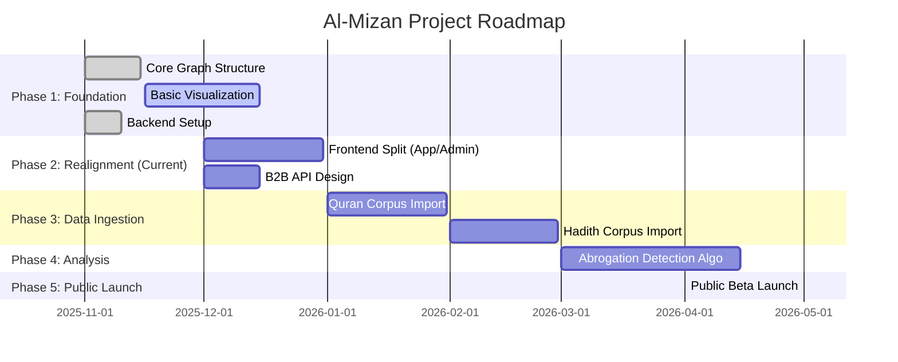

# Project Roadmap

This document outlines the strategic direction and milestones for the Al-Mizan Project.

## Timeline

## Milestones

### Q4 2025 - Foundation & Realignment

- [x] Establish Clean Architecture.
- [x] Set up SurrealDB schema.
- [ ] **Split Frontend**: Separate "Certainty Engine" and "Verification Console".
- [ ] **B2B API Strategy**: Design the "Credibility-as-a-Service" API.

### Q1 2026 - Data Richness

- [ ] Import full Uthmani Quran text.
- [ ] Import Kutub al-Sittah (Six major Hadith collections).

### Q2 2026 - Intelligence

- [ ] Implement graph traversal algorithms for Naskh chains.
- [ ] Release public API documentation.
